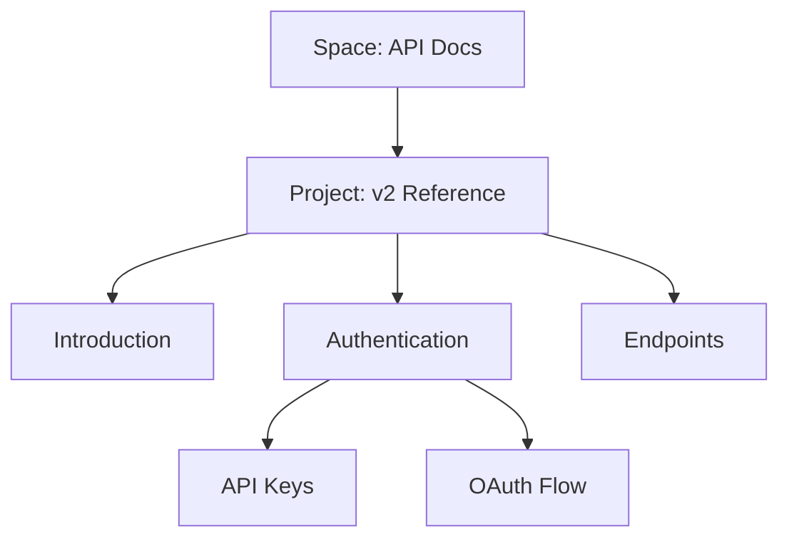

## Overview

Anton K provides a flexible documentation platform where you organize content into spaces and projects. Master these core concepts to build efficient, searchable documentation sites. You create hierarchies of pages, leverage powerful search, and use navigation tools to guide users seamlessly.

<Columns cols={3}>
  <Card title="Documentation Spaces" icon="folder" href="#documentation-spaces">
    Group related projects into dedicated spaces for team collaboration.
  </Card>
  <Card title="Page Hierarchies" icon="layout" href="#page-hierarchies">
    Structure pages with nested organization for intuitive browsing.
  </Card>
  <Card title="Search & Navigation" icon="search" href="#search-navigation">
    Find content quickly with advanced search and dynamic menus.
  </Card>
</Columns>

## Documentation Spaces and Projects

You start by creating a documentation space, which acts as a top-level container for multiple projects. Each space supports custom branding, permissions, and workflows tailored to your team.

<Callout kind="tip">
  Use separate spaces for products, internal wikis, and public docs to maintain clear boundaries.
</Callout>

<Steps>
  <Step title="Create a Space" icon="plus">
    Navigate to your dashboard and select `New Space`. Enter a name like `API Docs` and choose visibility settings.
  </Step>
  <Step title="Add Projects" icon="package">
    Inside the space, create projects such as `v1 Reference` or `User Guide`.
  </Step>
  <Step title="Invite Collaborators" icon="users">
    Assign roles: admin for full control, editor for content updates, viewer for read-only access.
  </Step>
</Steps>

Spaces enable version control per project, so you publish updates without affecting the entire site.

## Page Hierarchies and Organization

Build intuitive structures with nested pages. The sidebar reflects your hierarchy, making navigation predictable.



Use frontmatter in MDX files to define metadata:

<CodeGroup tabs="MDX Frontmatter">
  ```mdx
  ---
  title: Authentication
  description: Secure your API access.
  ---
  ```
  ```yaml
  # YAML equivalent for configs
  title: Authentication
  sidebar_position: 2
  ```
</CodeGroup>

Set `sidebar_position` to control order. Drag-and-drop in the editor for quick reordering.

<Expandable title="Advanced Hierarchy Tips" default-open="false">

  - Use anchors for in-page navigation: `[Jump to Setup](#setup)`
  - Generate dynamic sidebars from `sidebar.ts` files.
  - Limit depth to three levels to avoid overwhelming users.

</Expandable>

## Search and Navigation Tools

Anton K's search indexes all content instantly. You type queries, and it surfaces relevant pages, sections, and even code snippets.

<Tabs>
  <Tab title="Global Search" icon="search">
    Press `<kbd>Ctrl</kbd>+<kbd>K</kbd>` (or `<kbd>Cmd</kbd>+<kbd>K</kbd>` on macOS) to open search. Filters include spaces, projects, and tags.
  </Tab>
  <Tab title="Faceted Navigation" icon="filter">
    Sidebar menus support categories. Add tags like `featured` or `beta` for dynamic grouping.
  </Tab>
  <Tab title="Breadcrumbs" icon="chevron-right">
    Always visible paths: `Home > Spaces > API Docs > Authentication`.
  </Tab>
</Tabs>

<Callout kind="info">
  Enable full-text search on custom fields by configuring `search.json` in your project root.
</Callout>

## Best Practices

Combine these concepts for scalable docs:

| Concept              | Best Practice                     | Benefit                  |
|----------------------|-----------------------------------|--------------------------|
| Spaces               | One per product/team             | Isolation and focus     |
| Hierarchies          | 3-level max, consistent naming   | Easy scanning           |
| Search               | Tag liberally, write descriptive titles | Faster discovery       |

Integrate with your workflow: link to GitHub for versioned edits and webhooks for auto-publishing. This foundation scales as your documentation grows.