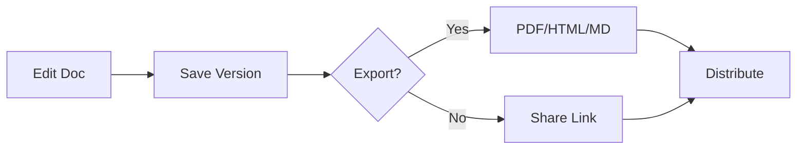

## Overview

Anton K provides powerful tools to create, manage, and share project documentation efficiently. You can edit rich content, track changes with version history, and export documents in multiple formats. These features streamline collaboration for teams working on technical docs, API references, or user guides.

<Columns cols={3}>
  <Card title="Rich Editing" icon="edit-3" href="#document-editing">
    Format text, add code blocks, and embed media seamlessly.
  </Card>
  <Card title="Version History" icon="git-branch" href="#version-control">
    Track changes, revert revisions, and compare versions.
  </Card>
  <Card title="Export & Share" icon="share-2" href="#exporting-sharing">
    Generate PDFs, share links, or integrate with tools.
  </Card>
</Columns>

## Document Editing and Formatting

Build professional documents with Anton K's intuitive editor. You support Markdown, MDX components, and real-time previews. Insert headings, lists, tables, and syntax-highlighted code blocks effortlessly.

<Callout kind="tip">
  Enable live preview mode to see changes instantly as you type.
</Callout>

Follow these steps to format a new document:

<Steps>
  <Step title="Create Document" icon="plus">
    Navigate to your workspace and click "New Document".
  </Step>
  <Step title="Add Formatting" icon="type">
    Use Markdown syntax or the toolbar for bold, italics, and links.
  </Step>
  <Step title="Insert Code" icon="code">
    Highlight code and select language for automatic syntax highlighting.
  </Step>
</Steps>

<CodeGroup tabs="Markdown,MDX">
  ```markdown
  ## Heading

  - List item
  - Another item

  Inline code: `const apiKey = 'your-key';`
  ```
  ```jsx
  ## Heading with Component

  <Callout kind="info">
    This is a callout.
  </Callout>

  Inline: `{user.id}`
  ```
</CodeGroup>

## Version Control and History

Anton K automatically saves every change, creating a complete version history. You can view diffs, restore previous versions, or branch documents for experiments.

<Tabs>
  <Tab title="View History" icon="clock">
    Click the history icon to see a timeline of edits.

    ```

    Recent changes:
    - v1.2: Added export feature
    - v1.1: Fixed table rendering
    ```

  </Tab>
  <Tab title="Compare Versions" icon="git-compare">
    Select two versions to highlight differences side-by-side.
  </Tab>
  <Tab title="Restore Version" icon="refresh-cw">
    Preview and revert to any saved state.
  </Tab>
</Tabs>

<Expandable title="Advanced Branching" default-open="false">
  Create branches for drafts without affecting the main document.

  ```

  Branch workflow:
  1. Fork document
  2. Edit in isolation
  3. Merge back with review
  ```
</Expandable>

## Exporting and Sharing Options

Share your documentation easily. Export to PDF, HTML, or Markdown files. Generate public links with permissions or embed in websites.

| Format | Use Case | Options |
|--------|----------|---------|
| PDF | Printable guides | Custom headers, page breaks |
| HTML | Web publishing | Include styles, interactive components |
| Markdown | Git repos | Raw source with frontmatter |
| Link | Collaboration | Read-only, edit access, expiration |

<Callout kind="success">
  Use password-protected links for sensitive project docs.
</Callout>



Ready to start? Check the [quickstart](/quickstart) for hands-on setup.